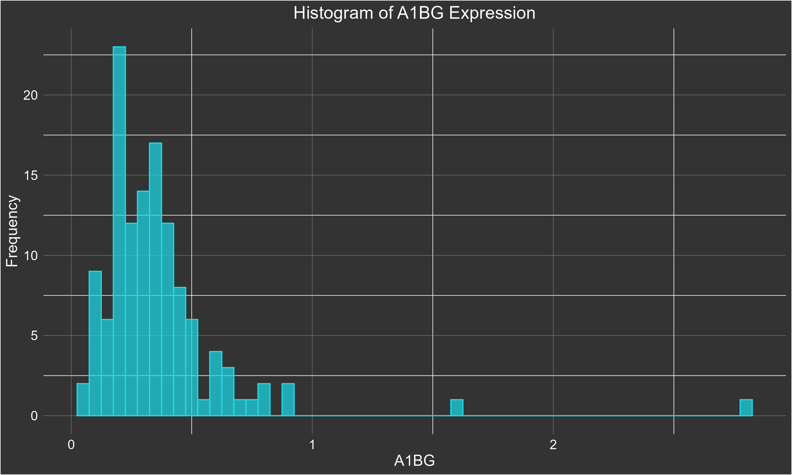
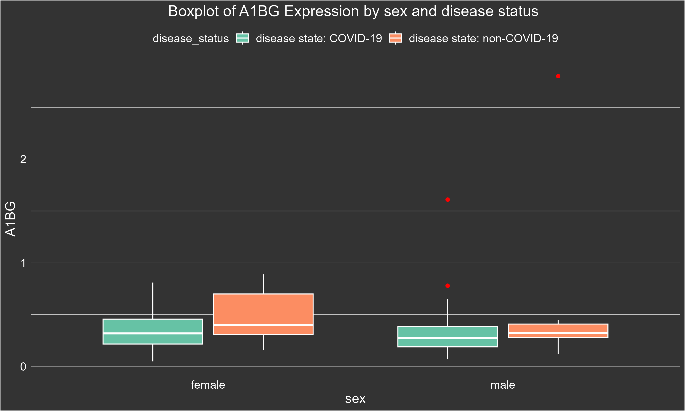
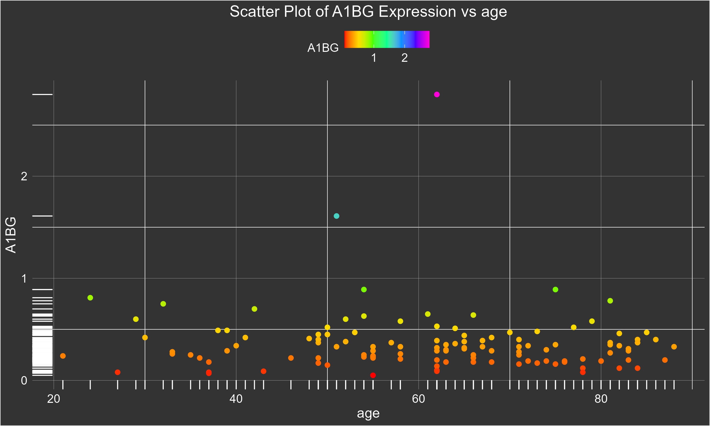
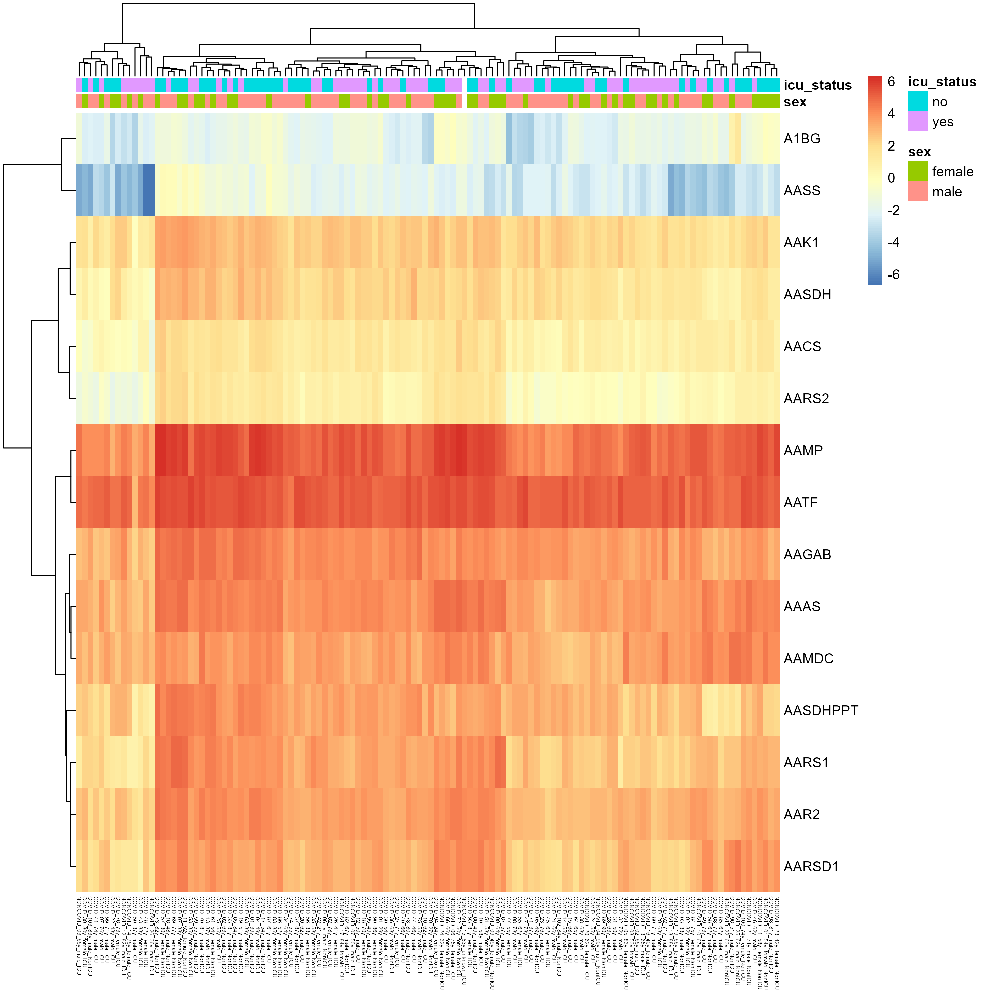
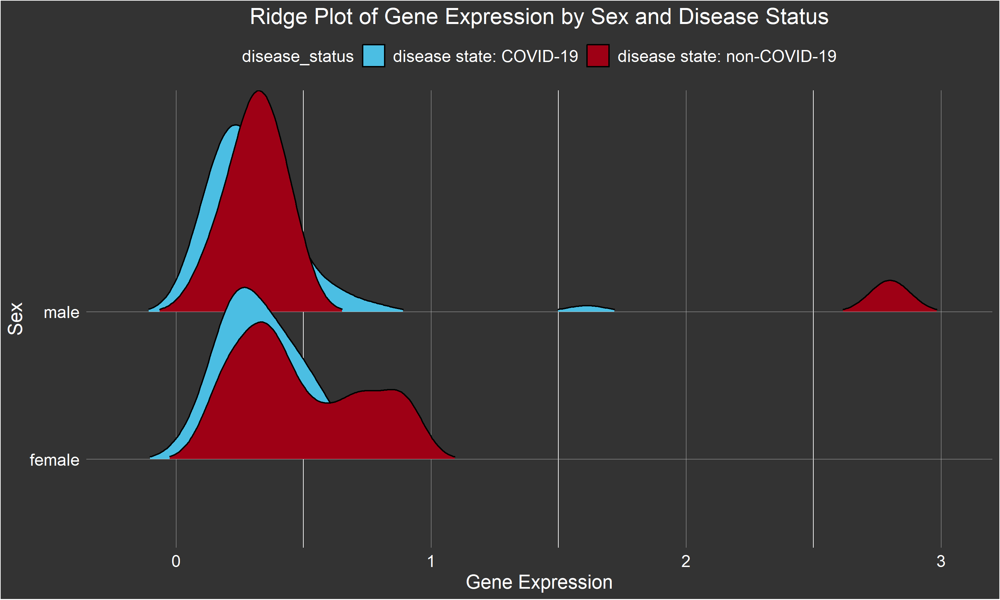

# QBS103 Project

This repository contains the code and data for the QBS103 project. The project includes analysis and visualization of gene expression data.

## Contents

- `QBS103.Rmd`: R Markdown file with the analysis.
- `QBS103.Rproj`: RStudio project file.
- `dataset/QBS103_GSE157103_genes.csv`: CSV file with gene data.
- `dataset/QBS103_GSE157103_series_matrix.csv`: CSV file with patients meta data.
- `LICENSE`: License for the project.
- `README.md`: This file.

## Analysis

The analysis is performed using R and includes the following visualizations:

### Histogram of Gene Expression

### Boxplot of Gene Expression by Sex and Disease Status

### Scatter Plot of Gene Expression vs. Age

### heatmap of 15 selected genes 

### ridge plot of Gene Expression vs. Sex and Disease Status

## Usage

To reproduce the analysis, open the `QBS103.Rproj` file in RStudio and knit the `final_sub.Rmd` file.

## License

This project is licensed under the MIT License. See the `LICENSE` file for details.